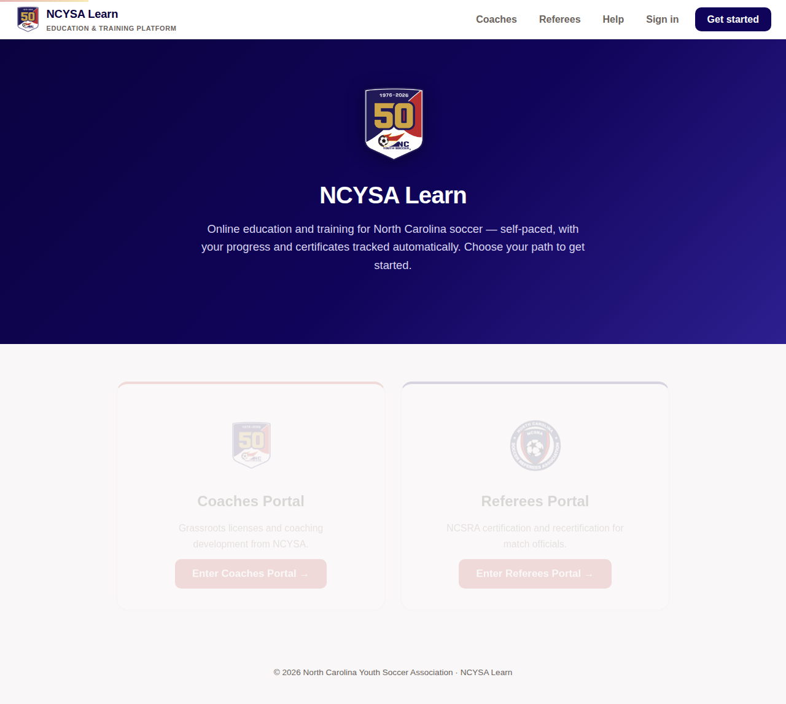

# NCYSA Learn — Coaching Education Platform

A self-hosted online course platform for the North Carolina Youth Soccer Association,
modeled on platforms like Thinkific and Teachable — but free, owned by NCYSA, and with
no per-seat fees. Ships with the **NCYSA Grassroots Soccer Coaching License** course.



## What it does

- **Course catalog & enrollment** — learners create a free account, enroll, and pick up
  where they left off.
- **Sequential lesson gating** — lessons unlock strictly in order. The gate is enforced
  **server-side**, so it can't be bypassed by clicking around or calling the API directly.
- **Verified video watching** — video lessons track *real playback time*. For the 60-second
  lesson video, learners must watch **58 seconds** before they can continue
  (generalized as `duration − 2s` via `minWatchSeconds`). Fast-forwarding snaps back,
  and watch time is accrued through rate-limited server heartbeats.
- **Graded final exam** — graded server-side (answer keys never reach the browser);
  80% required to pass, unlimited retakes.
- **Completion notifications, both directions** — the moment a learner finishes:
  - the **learner** gets an in-app notification (🔔 bell) and a congratulations email;
  - **NCYSA** gets an in-app notification on the admin dashboard and a license-record email.
- **Certificates** — every completion mints a printable certificate with a unique ID.
- **NCYSA Education Dashboard** — admin view of all completions (license records),
  NCYSA notifications, and the full email outbox.

## Quick start

```bash
npm install
npm start          # http://localhost:3000
```

Sign in as NCYSA staff to see the dashboard: `admin@ncysa.org` / `ncysa-admin`
(override with `ADMIN_EMAIL` / `ADMIN_PASSWORD`).

## Email delivery

Every notification email is always recorded in the outbox (visible on the admin
dashboard). To deliver them externally, set:

| Variable | Purpose |
|---|---|
| `NCYSA_NOTIFY_EMAIL` | Where NCYSA completion notices go (default `education@ncysa.org`) |
| `NOTIFY_WEBHOOK_URL` | Each email is POSTed as JSON to this URL — point it at a Zapier/Make/Slack webhook or any mail relay endpoint |
| `ADMIN_EMAIL` / `ADMIN_PASSWORD` | NCYSA staff login |
| `PORT` / `DATA_DIR` | Server port and data directory |

## Testing

The end-to-end test takes the entire course in a real browser — registers, enrolls,
tries to open locked lessons, tries to skip the video, actually watches it, fails the
exam, passes it, and then verifies the certificate plus both notifications and both
emails on the NCYSA dashboard:

```bash
npm test           # Playwright, writes screenshots/ along the way
```


## Deploying (production in an afternoon)

The app is a single Node.js process — any host that runs Node works.

**Easiest: Render.** This repo includes `render.yaml`. On [render.com](https://render.com):
New + → Blueprint → select this repo → deploy. You get an HTTPS URL immediately;
add a custom domain (e.g. `learn.ncysa.org`) with one CNAME record. The included
persistent disk keeps learner records across deploys. (~$7/mo starter instance
+ $0.25/mo disk.)

**Also works:** Railway, Fly.io, or any $5 VPS — a `Dockerfile` is included.
Set `DATA_DIR` to a persisted path so records survive restarts.

**Real email in 10 minutes:** create a free [Zapier](https://zapier.com) or
[Make](https://make.com) webhook that forwards to Gmail/Outlook, and set it as
`NOTIFY_WEBHOOK_URL`. Every completion notice then lands in real inboxes; the
in-app outbox keeps a copy regardless.

## Architecture

```
server.js          Express API + static hosting; all gating rules enforced here
lib/store.js       JSON-file persistence (swap for a real DB when needed)
lib/notifier.js    In-app + email notification engine
data/courses.js    Course content (versioned in git like code)
public/            Single-page app (vanilla JS, no build step)
tests/e2e.spec.js  Full learner-journey browser test
```

Adding a course = adding an object to `data/courses.js`. Lesson types: `text`,
`video` (with `minWatchSeconds`), and `quiz` (with `passPercent`).
